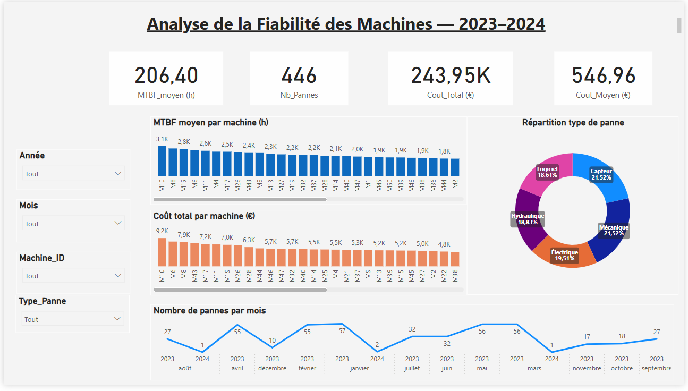

# 🔧 Analyse de la Fiabilité des Machines — 2023–2024

## 📄 Contexte  
Dans le cadre d’un projet industriel simulé, j’ai mené une **analyse de la fiabilité d’un parc machines** à l’aide de **Power BI**.  
Le jeu de données reproduit les **pannes, les heures de fonctionnement** et les **coûts de maintenance** d’un site de production.  
L’objectif principal était d’évaluer la performance opérationnelle (MTBF, coûts, fréquence des pannes) et de dégager des pistes d’amélioration de la fiabilité.

---

## 🎯 Objectifs du projet  
- Suivre les principaux indicateurs de fiabilité : **MTBF**, **nombre de pannes**, **coûts de maintenance**.  
- Identifier les **machines les plus critiques** ou les plus coûteuses.  
- Visualiser la **répartition des types de pannes**.  
- Étudier l’**évolution mensuelle des défaillances**.  
- Proposer des **actions correctives** pour réduire les pannes et optimiser les coûts.

---

## 🧩 Données utilisées  
| Variable | Description |
|-----------|-------------|
| `Machine_ID` | Identifiant unique de la machine |
| `Date_Panne` | Date de la panne |
| `Type_Panne` | Type de panne (mécanique, logiciel, capteur, etc.) |
| `Heures_Fonctionnement` | Heures de fonctionnement avant panne |
| `Cout_Maintenance (€)` | Coût associé à la maintenance |
| `Période` | Années 2023–2024 |

---

## ⚙️ Étapes de réalisation  

### 1️⃣ Préparation et nettoyage  
- Création d’un **jeu de données simulé sous Excel**  
- Suppression des doublons et vérification de la cohérence des valeurs  
- Importation dans **Power BI** et typage des colonnes  

### 2️⃣ Création des indicateurs dans Power BI (measures DAX)
```DAX
MTBF_Moyen = AVERAGE('Pannes'[Heures_Fonctionnement])
Nb_Pannes = COUNTROWS('Pannes')
Cout_Total = SUM('Pannes'[Cout_Maintenance])
Cout_Moyen = AVERAGE('Pannes'[Cout_Maintenance])

# 🧠 Tableau de bord Maintenance Industrielle – Analyse des Pannes

## 🎯 Objectif
Ce projet vise à concevoir un **dashboard interactif Power BI** permettant d’analyser la fiabilité des équipements et d’optimiser la stratégie de maintenance à partir d’un dataset simulé.  

L’objectif est de fournir une vision claire et dynamique des **indicateurs clés (KPI)** tels que le **MTBF**, le **nombre de pannes**, et les **coûts de maintenance**.

---

## 🧩 3️⃣ Construction des visualisations

### 📋 Cartes KPI
- **MTBF (Mean Time Between Failures)**  
- **Nombre de pannes**  
- **Coût total de maintenance**  
- **Coût moyen par panne**

### 📊 Graphiques en barres
- MTBF par machine  
- Coût total par machine  

### 🥧 Diagramme circulaire
- Répartition des **types de pannes**

### 📈 Courbe temporelle
- Évolution **mensuelle du nombre de pannes**

### 🔍 Filtres dynamiques
- **Année**  
- **Mois**  
- **Machine_ID**  
- **Type_Panne**

---

## 📊 Résultats clés

| Indicateur | Valeur |
|-------------|---------|
| **MTBF moyen** | 206 h |
| **Nombre total de pannes** | 446 |
| **Coût total de maintenance** | 243,9 K€ |
| **Coût moyen par panne** | 546,9 € |

---

## 💡 Analyse et recommandations

- ⚙️ **Machines M10, M6 et M15** : concentrent le plus grand nombre de pannes → à **cibler en priorité pour la maintenance préventive**.  
- 🔧 **Pannes mécaniques et capteurs** : représentent **plus de 40 %** des cas → besoin d’un **plan d’action spécifique**.  
- ⏱ **MTBF global faible** : opportunité d’introduire une **maintenance prédictive**.  
- 💶 **Coût moyen stable** : bonne maîtrise opérationnelle, mais possibilité d’**optimisation ciblée sur les machines critiques**.

---

## 🛠 Compétences mobilisées

| Domaine | Compétences |
|----------|--------------|
| **Power BI** | Modélisation, DAX, conception d’un dashboard interactif |
| **Analyse de fiabilité** | Calcul du MTBF, fréquence de panne, logique de maintenance |
| **Data storytelling** | Présentation claire et interprétation des résultats |
| **Excel** | Création et structuration du dataset simulé |

📂 Projet_Fiabilite
│
├── Projet_Fiabilite_Dataset.xlsx     # Données sources simulées  
├── Dashboard_Fiabilite.pbix          # Fichier Power BI  
├── screenshot_dashboard.png          # Aperçu du tableau de bord  
└── README.md                         # Présentation du projet  

---

## 🖼️ Aperçu du Dashboard


